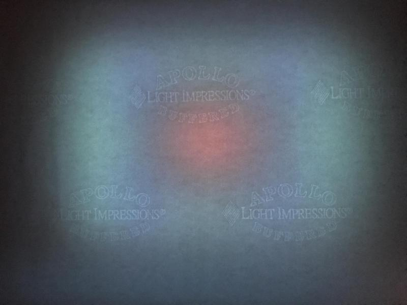

# TransLux
Trans Lux, Atari BASIC art by Hal Glicksman

Hal Glicksman sent me an email on Jan 28, 2018:

>In 1983 an artist invited me to make an artwork for a small magazine called EYE. Each invited artist would create 100 signed prints that would be collated and bound into 100 issues. The theme of the issue was "Available Light" and I wrote an Atari program called "Trans-Lux." I printed the code out 100 times on a dot matrix printer and signed each copy. The pages were bound into the magazine with tractor feed holes still attached. I had forgotten completely about the magazine and did not have a copy. I was alerted to a copy for sale by Google search and had to pay for a copy of my own work.
>I would love your help recreating this work on an Atari emulator with a web interface. I have not touched an Atari or written BASIC for more than 30 years. I would love to see it again and there is a chance it may be shown in and art exhibition.

Hal wrote back the next day:

>Here are some photos of your Youtube video of Trans Lux with a diffuser in front of the screen. It did not take much to keep artists happy in those days, especially if they were stoned. Computers were a complete mystery to them, and it was also before Photoshop or screen savers.

Video of the program in action: https://youtu.be/2aa_DkAcmdc

I interviewed Hal for ANTIC: The Atari 8-Bit Podcast in 2017. Listen to it, he's an interesting guy. http://ataripodcast.libsyn.com/antic-interview-304-hal-glicksman-datamost
